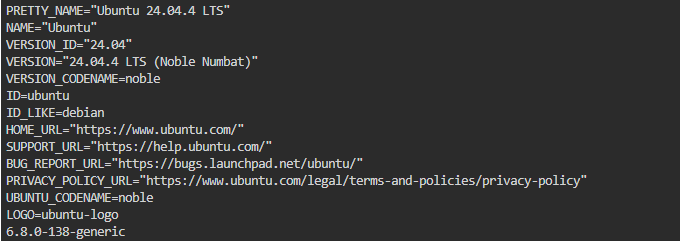
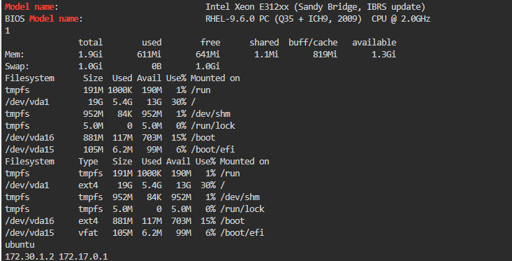

# Infrastructure Report

## Operating System
- OS: Ubuntu 22.04 LTS
- Kernel Version: 5.15.0-...

## CPU
- Model: (paste yours)
- Cores: (paste yours)

## Memory
- Total RAM: (paste yours)

## Storage
- Disk Capacity: (paste yours)
- Mounted File Systems: (paste yours)

## Network
- Hostname: (paste yours)
- IP Address: (paste yours)

